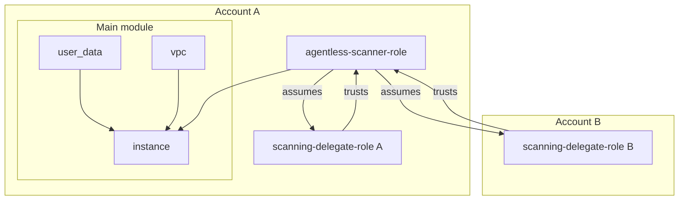

# Terraform Module Datadog Agentless Scanner

This Terraform module provides a simple and reusable configuration for installing a Datadog Agentless Scanner.

This document covers installation on AWS. For [Azure](./azure) and [GCP](./gcp) instructions, please see their respective directories.

For more information about Agentless Scanning, see the [Datadog Agentless Scanning documentation](https://docs.datadoghq.com/security/cloud_security_management/agentless_scanning/).

## Prerequisites

Before using this module, make sure you have the following:

1. [Terraform](https://www.terraform.io/) v1.2.0 or later installed on your local machine.
2. AWS credentials configured with the necessary permissions.
3. A Datadog [API key](https://docs.datadoghq.com/account_management/api-app-keys/) with Remote Configuration enabled.

## Usage

To use this module in your Terraform configuration, add the following code in your existing Terraform code:

```hcl
# First we need to define the proper roles for our scanners. It consists of two different modules.

# 1. The "scanning delegate role" defines all the policies and IAM roles necessary for the scanner to interact and scan some specific account resources.
# It shall be created for every account that the agentless scanner will be able scan. These roles are meant to be assumed by the "agentless scanner role".
module "delegate_role" {
  source = "git::https://github.com/DataDog/terraform-module-datadog-agentless-scanner//modules/scanning-delegate-role"

  scanner_roles = [module.scanner_role.role.arn]
}

# 2. The "agentless scanner role" creates an EC2 instance profile along with an IAM role allowing the EC2 instance scanner to assume the scanning delegate role(s).
# It shall be created in the same account as the agentless scanner instance.
module "scanner_role" {
  source = "git::https://github.com/DataDog/terraform-module-datadog-agentless-scanner//modules/agentless-scanner-role"

  api_key_secret_arns = [module.agentless_scanner.api_key_secret_arn]
}

# We can now create the agentless scanner instance. It requires the instance profile name that was created by the scanner_role.
# This module will define the VPC, subnets, network and compute resources required for the agentless scanner.
# See the documentation of each module for more information or our examples for a complete setup.
module "agentless_scanner" {
  source = "git::https://github.com/DataDog/terraform-module-datadog-agentless-scanner"

  api_key               = var.datadog-api-key
  instance_profile_name = module.scanner_role.instance_profile.name
}

# Finally, we can enable automatic scaling of agentless scanners.
# Agentless scanners will scale up when there are many resources to scan and scale down when fewer resources are present.
# This ensures efficient performance and cost optimization.
# It shall be created in the same account as the agentless scanner instance.
module "autoscaling_scanners" {
  source                   = "git::https://github.com/DataDog/terraform-module-datadog-agentless-scanner//modules/agentless-scanners-autoscaling"
  datadog_integration_role = var.datadog-integration-role
}

# This is the AWS role name that was used to create the Datadog integration in AWS for the account where the agentless scanner is deployed.
# In order to fetch the role name, please navigate to the AWS Integration page (https://app.datadoghq.com/integrations/amazon-web-services),
# click on the account in which the agentless scanner will be running, then click on the "Account details" tab.
# The role name could be found under the "AWS Role Name" section.
variable "datadog-integration-role" {

}

variable "datadog-api-key" {

}
```

And run:
```sh
terraform init
terraform apply \
  -var="datadog-api-key=$DD_API_KEY" \
  -var="datadog-integration-role=$DD_INTEGRATION_ROLE"
```

> [!IMPORTANT]
> Datadog strongly recommends [pinning](https://developer.hashicorp.com/terraform/language/modules/sources#selecting-a-revision) the version of the module to keep repeatable deployment and to avoid unexpected changes.

## Uninstall

To uninstall, remove the Agentless scanner module from your Terraform code. Removing this module deletes all resources associated with the Agentless scanner. Alternatively, if you used a separate Terraform state for this setup, you can uninstall the Agentless scanner by executing `terraform destroy`.

> [!WARNING]
> Exercise caution when deleting Terraform resources. Review the plan carefully to ensure everything is in order.

## Architecture

The Agentless Scanner deployment is split into different modules to allow for more flexibility and customization. The following modules are available:

- [scanning-delegate-role](./modules/scanning-delegate-role/): Creates the necessary IAM role and policies for the scanning delegate. It creates an IAM role in a specific account that the scanner can then assume to scan the account. This role allows read access to many different resources (EBS snapshots, Lambdas etc.) in the account to be able to scan them.
- [agentless-scanner-role](./modules/agentless-scanner-role/): Creates the necessary IAM role and policies for the agentless scanner instance. It creates an IAM role that allows the scanner to assume the role of the scanning delegate.
- [instance](./modules/instance/): Creates the EC2 instance that runs the agentless scanner. This instance is launched as part of an Auto Scaling group to ensure high availability.
- [user_data](./modules/user_data/): Creates the user data script that installs and configures the agentless scanner on the EC2 instance.
- [vpc](./modules/vpc/): Creates the VPC, subnets and all network resources required for the agentless scanner.

The main module provided at the root of this repository is a thin wrapper around the vpc, user_data and instance modules, with simplified inputs. The scanning-delegate-role and agentless-scanner-role modules are intended to be used in conjunction with this module, as they define the proper IAM permissions for the scanner.



## Examples

For complete examples, refer to the [examples](./examples/) directory in this repository.

## Development

Install pre-commit checks:

```
pre-commit install
```

Automatically generate documentation for the Terraform modules:

```
pre-commit run terraform-docs-go -a
```

Lint Terraform code:

```
pre-commit run terraform_fmt -a
pre-commit run terraform_tflint -a
```

Run all checks:

```
pre-commit run -a
```

## Changelog

See [changelog](CHANGELOG.md).

<!-- BEGIN_TF_DOCS -->
## Requirements

| Name | Version |
|------|---------|
| <a name="requirement_terraform"></a> [terraform](#requirement\_terraform) | >= 1.2.0 |
| <a name="requirement_aws"></a> [aws](#requirement\_aws) | >= 5.0 |

## Providers

No providers.

## Modules

| Name | Source | Version |
|------|--------|---------|
| <a name="module_instance"></a> [instance](#module\_instance) | ./modules/instance | n/a |
| <a name="module_user_data"></a> [user\_data](#module\_user\_data) | ./modules/user_data | n/a |
| <a name="module_vpc"></a> [vpc](#module\_vpc) | ./modules/vpc | n/a |

## Resources

No resources.

## Inputs

| Name | Description | Type | Default | Required |
|------|-------------|------|---------|:--------:|
| <a name="input_agent_configuration"></a> [agent\_configuration](#input\_agent\_configuration) | Specifies a custom configuration for the Datadog Agent. The specified object is passed directly as a configuration input for the Datadog Agent. For more details: https://docs.datadoghq.com/agent/configuration/agent-configuration-files/. Warning: this is an advanced feature and can break the Datadog Agent if not used correctly. | `any` | `{}` | no |
| <a name="input_api_key"></a> [api\_key](#input\_api\_key) | Specifies the API key required by the Agentless Scanner to submit vulnerabilities to Datadog - Make sure the API key is Remote Configuration enabled. | `string` | `null` | no |
| <a name="input_api_key_secret_arn"></a> [api\_key\_secret\_arn](#input\_api\_key\_secret\_arn) | ARN of the secret holding the Datadog API key. Takes precedence over api\_key variable - Make sure the API key is Remote Configuration enabled. | `string` | `null` | no |
| <a name="input_enable_ssm"></a> [enable\_ssm](#input\_enable\_ssm) | Whether to enable AWS SSM to facilitate executing troubleshooting commands on the instance | `bool` | `false` | no |
| <a name="input_enable_ssm_vpc_endpoint"></a> [enable\_ssm\_vpc\_endpoint](#input\_enable\_ssm\_vpc\_endpoint) | Whether to enable AWS SSM VPC endpoint (only applicable if enable\_ssm is true) | `bool` | `true` | no |
| <a name="input_instance_count"></a> [instance\_count](#input\_instance\_count) | Default size of the autoscaling group the instance is in (i.e. number of instances with scanners to run) | `number` | `1` | no |
| <a name="input_instance_profile_name"></a> [instance\_profile\_name](#input\_instance\_profile\_name) | Name of the instance profile to attach to the instance | `string` | n/a | yes |
| <a name="input_instance_type"></a> [instance\_type](#input\_instance\_type) | The type of instance running the scanner | `string` | `"t4g.medium"` | no |
| <a name="input_scanner_channel"></a> [scanner\_channel](#input\_scanner\_channel) | Channel of the scanner to install from (stable or beta). | `string` | `"stable"` | no |
| <a name="input_scanner_configuration"></a> [scanner\_configuration](#input\_scanner\_configuration) | Specifies a custom configuration for the scanner. The specified object is passed directly as a configuration input for the scanner. Warning: this is an advanced feature and can break the scanner if not used correctly. | `any` | `{}` | no |
| <a name="input_scanner_repository"></a> [scanner\_repository](#input\_scanner\_repository) | Repository URL to install the scanner from. | `string` | `"https://apt.datadoghq.com/"` | no |
| <a name="input_scanner_version"></a> [scanner\_version](#input\_scanner\_version) | Version of the scanner to install | `string` | `"0.11"` | no |
| <a name="input_site"></a> [site](#input\_site) | By default the Agent sends its data to Datadog US site. If your organization is on another site, you must update it. See https://docs.datadoghq.com/getting_started/site/ | `string` | `null` | no |
| <a name="input_tags"></a> [tags](#input\_tags) | A map of additional tags to add to the IAM role/profile created | `map(string)` | `{}` | no |

## Outputs

| Name | Description |
|------|-------------|
| <a name="output_api_key_secret_arn"></a> [api\_key\_secret\_arn](#output\_api\_key\_secret\_arn) | The ARN of the secret containing the Datadog API key |
| <a name="output_vpc"></a> [vpc](#output\_vpc) | The VPC created for the Datadog agentless scanner |
<!-- END_TF_DOCS -->
