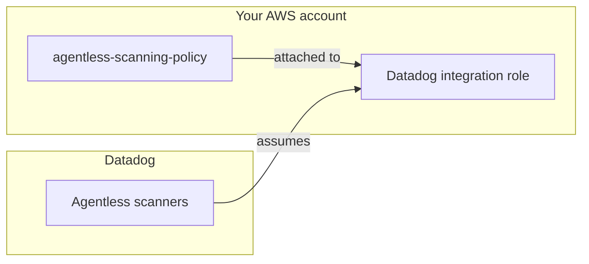
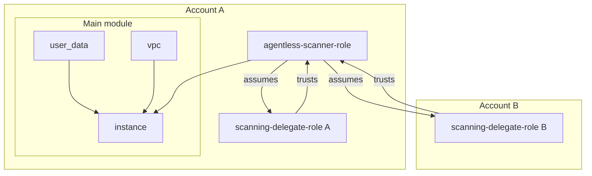

# Terraform Module Datadog Agentless Scanner

Terraform modules to set up [Datadog Agentless Scanning](https://docs.datadoghq.com/security/cloud_security_management/agentless_scanning/) on AWS, Azure and GCP.

This document covers AWS. For [Azure](./azure) and [GCP](./gcp) instructions, please see their respective directories.

## Examples

- **AWS**: see the [examples](./examples/) directory.
- **Azure**: see the [Azure module](./azure/README.md#usage), or the [ARM template](./azure/arm/).
- **GCP**: see the [GCP examples](./gcp/examples/) directory.

> [!IMPORTANT]
> Datadog strongly recommends [pinning](https://developer.hashicorp.com/terraform/language/modules/sources#selecting-a-revision) the version of the module to keep repeatable deployment and to avoid unexpected changes.

## AWS Architecture

Datadog offers two ways to deploy Agentless Scanning on AWS: SaaS mode, where scanners run in Datadog's infrastructure, or self-hosted mode, where scanners run in your own AWS account.

### SaaS mode

Scanners run in Datadog's infrastructure: nothing is deployed in your account. The [agentless-scanning-policy](./modules/agentless-scanning-policy/) module provides the scanning permissions, which are attached as a managed policy to the Datadog integration role. Datadog assumes this role to perform the scans.


```mermaid
flowchart LR
    subgraph "Datadog"
      S[Agentless scanners]
    end

    subgraph "Your AWS account"
      IR[Datadog integration role]
      P[agentless-scanning-policy]
      P-- attached to -->IR
    end

    S-- assumes -->IR
```

### Self-hosted mode

Scanners run in your own AWS infrastructure. The following modules are used:

- [Main module](./main.tf): a thin wrapper around the [vpc](./modules/vpc/), [user_data](./modules/user_data/) and [instance](./modules/instance/) modules, which create the network, the scanner install script and the Auto Scaling group running the scanners.
- [agentless-scanner-role](./modules/agentless-scanner-role/): IAM role and instance profile for the scanner instances, allowing them to assume the scanning delegate roles.
- [scanning-delegate-role](./modules/scanning-delegate-role/): IAM role created in each scanned account, holding the permissions to scan its resources (EBS snapshots, Lambdas, etc.).
- [agentless-scanners-autoscaling](./modules/agentless-scanners-autoscaling/): attaches the policy allowing Datadog to scale the scanners up or down based on load.
- [agentless-s3-bucket](./modules/agentless-s3-bucket/): S3 bucket used to scan RDS snapshot exports (optional).


```mermaid
flowchart TD
    subgraph "Account A"
      subgraph "Main module"
          UD[user_data]
          VPC[vpc]
          I[instance]
          UD-->I
          VPC-->I
        end

        SR[agentless-scanner-role]
        SR-->I

        DRA[scanning-delegate-role A]
        DRA-- trusts -->SR
        SR-- assumes -->DRA
    end

    subgraph "Account B"
      DRB[scanning-delegate-role B]
      DRB-- trusts -->SR
      SR-- assumes -->DRB
    end
```

## Development

Install pre-commit checks:

```
pre-commit install
```

Automatically generate documentation for the Terraform modules:

```
pre-commit run terraform-docs-go -a
```

Lint Terraform code:

```
pre-commit run terraform_fmt -a
pre-commit run terraform_tflint -a
```

Run all checks:

```
pre-commit run -a
```

## Changelog

See [changelog](CHANGELOG.md).

<!-- BEGIN_TF_DOCS -->
## Requirements

| Name | Version |
|------|---------|
| <a name="requirement_terraform"></a> [terraform](#requirement\_terraform) | >= 1.2.0 |
| <a name="requirement_aws"></a> [aws](#requirement\_aws) | >= 5.0 |

## Providers

No providers.

## Modules

| Name | Source | Version |
|------|--------|---------|
| <a name="module_instance"></a> [instance](#module\_instance) | ./modules/instance | n/a |
| <a name="module_user_data"></a> [user\_data](#module\_user\_data) | ./modules/user_data | n/a |
| <a name="module_vpc"></a> [vpc](#module\_vpc) | ./modules/vpc | n/a |

## Resources

No resources.

## Inputs

| Name | Description | Type | Default | Required |
|------|-------------|------|---------|:--------:|
| <a name="input_agent_configuration"></a> [agent\_configuration](#input\_agent\_configuration) | Specifies a custom configuration for the Datadog Agent. The specified object is passed directly as a configuration input for the Datadog Agent. For more details: https://docs.datadoghq.com/agent/configuration/agent-configuration-files/. Warning: this is an advanced feature and can break the Datadog Agent if not used correctly. | `any` | `{}` | no |
| <a name="input_api_key"></a> [api\_key](#input\_api\_key) | Specifies the API key required by the Agentless Scanner to submit vulnerabilities to Datadog - Make sure the API key is Remote Configuration enabled. | `string` | `null` | no |
| <a name="input_api_key_secret_arn"></a> [api\_key\_secret\_arn](#input\_api\_key\_secret\_arn) | ARN of the secret holding the Datadog API key. Takes precedence over api\_key variable - Make sure the API key is Remote Configuration enabled. | `string` | `null` | no |
| <a name="input_enable_ssm"></a> [enable\_ssm](#input\_enable\_ssm) | Whether to enable AWS SSM to facilitate executing troubleshooting commands on the instance | `bool` | `false` | no |
| <a name="input_enable_ssm_vpc_endpoint"></a> [enable\_ssm\_vpc\_endpoint](#input\_enable\_ssm\_vpc\_endpoint) | Whether to enable AWS SSM VPC endpoint (only applicable if enable\_ssm is true) | `bool` | `true` | no |
| <a name="input_instance_count"></a> [instance\_count](#input\_instance\_count) | Default size of the autoscaling group the instance is in (i.e. number of instances with scanners to run) | `number` | `1` | no |
| <a name="input_instance_profile_name"></a> [instance\_profile\_name](#input\_instance\_profile\_name) | Name of the instance profile to attach to the instance | `string` | n/a | yes |
| <a name="input_instance_type"></a> [instance\_type](#input\_instance\_type) | The type of instance running the scanner | `string` | `"t4g.medium"` | no |
| <a name="input_scanner_channel"></a> [scanner\_channel](#input\_scanner\_channel) | Channel of the scanner to install from (stable or beta). | `string` | `"stable"` | no |
| <a name="input_scanner_configuration"></a> [scanner\_configuration](#input\_scanner\_configuration) | Specifies a custom configuration for the scanner. The specified object is passed directly as a configuration input for the scanner. Warning: this is an advanced feature and can break the scanner if not used correctly. | `any` | `{}` | no |
| <a name="input_scanner_repository"></a> [scanner\_repository](#input\_scanner\_repository) | Repository URL to install the scanner from. | `string` | `"https://apt.datadoghq.com/"` | no |
| <a name="input_scanner_version"></a> [scanner\_version](#input\_scanner\_version) | Version of the scanner to install | `string` | `"0.11"` | no |
| <a name="input_site"></a> [site](#input\_site) | By default the Agent sends its data to Datadog US site. If your organization is on another site, you must update it. See https://docs.datadoghq.com/getting_started/site/ | `string` | `null` | no |
| <a name="input_tags"></a> [tags](#input\_tags) | A map of additional tags to add to the IAM role/profile created | `map(string)` | `{}` | no |

## Outputs

| Name | Description |
|------|-------------|
| <a name="output_api_key_secret_arn"></a> [api\_key\_secret\_arn](#output\_api\_key\_secret\_arn) | The ARN of the secret containing the Datadog API key |
| <a name="output_vpc"></a> [vpc](#output\_vpc) | The VPC created for the Datadog agentless scanner |
<!-- END_TF_DOCS -->
