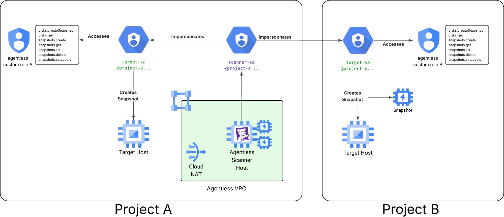

# Terraform Module Datadog Agentless Scanner for GCP

This Terraform module provides a simple and reusable configuration for installing a Datadog Agentless Scanner on Google Cloud Platform (GCP).

## Prerequisites

Before using this module, make sure you have the following:

1. [Terraform](https://www.terraform.io/) v1.0 or later installed on your local machine.
2. The [Google Cloud CLI](https://cloud.google.com/sdk/docs/install) installed on your local machine.
3. GCP credentials configured with the necessary permissions to create:
   - VPC networks and subnets
   - Compute Engine instances and instance templates
   - Service accounts and IAM bindings
   - Secret Manager secrets (if using api_key parameter)
4. A Datadog [API key](https://docs.datadoghq.com/account_management/api-app-keys/) with Remote Configuration enabled.
5. A GCP project with the following APIs enabled:
   - Compute Engine API
   - IAM Service Account Credentials API
   - Secret Manager API (if using api_key parameter)

## Usage

This is a quick example showing how to use this module. For more detailed examples with different deployment scenarios, refer to the [examples](./examples/) directory.

```hcl
variable "project_id" {
  description = "GCP project ID"
  type        = string
}

variable "datadog_api_key" {
  description = "Datadog API key with Remote Configuration enabled"
  type        = string
  sensitive   = true
}

variable "datadog_site" {
  description = "Datadog site (e.g., datadoghq.com, datadoghq.eu, us3.datadoghq.com, us5.datadoghq.com, ap1.datadoghq.com, ap2.datadoghq.com, ddog-gov.com)"
  type        = string
}

provider "google" {
  project = var.project_id
  region  = "us-central1"
}

module "datadog_agentless_scanner" {
  source = "git::https://github.com/DataDog/terraform-module-datadog-agentless-scanner//gcp?ref=0.11.12"

  site     = var.datadog_site
  vpc_name = "datadog-agentless-scanner"
  api_key  = var.datadog_api_key
}
```

And run:
```sh
terraform init
terraform apply \
  -var="project_id=<your-project-id>" \
  -var="datadog_api_key=$DD_API_KEY" \
  -var="datadog_site=<your-datadog-site>"
```

> [!IMPORTANT]
> Datadog strongly recommends [pinning](https://developer.hashicorp.com/terraform/language/modules/sources#selecting-a-revision) the version of the module to keep repeatable deployment and to avoid unexpected changes. Use a specific tag instead of a branch name.

### Configuration Notes

- **`site`**: Must match the Datadog site parameter of your account (see [Datadog site documentation](https://docs.datadoghq.com/getting_started/site/#access-the-datadog-site)). Common values: `datadoghq.com`, `datadoghq.eu`, `us3.datadoghq.com`, `us5.datadoghq.com`, `ap1.datadoghq.com`, `ap2.datadoghq.com`, `ddog-gov.com`.
- **`vpc_name`**: Name prefix for the VPC resources where the Agentless scanner is created. For security reasons, this VPC should be reserved for the exclusive use of the scanner.
- **`api_key`**: The Datadog API key is stored in Google Secret Manager and accessed by the scanner instances. Alternatively, you can use `api_key_secret_id` to reference an existing secret.
- **Service Accounts**: The module automatically creates two service accounts:
  - **Scanner Service Account**: Attached to the compute instances, with permissions to read secrets and impersonate the target service account.
  - **Impersonated Service Account**: Used for scanning resources, with read permissions on compute disks and snapshots.

## Examples

For complete examples, refer to the [examples](./examples/) directory:

### [Single Region](./examples/single_region/) - Simple Setup
Deploy scanners in a single GCP region and project. **Ideal for single-project setups.**

- ✅ Simple deployment model
- ✅ Single project, single region
- ✅ Multi-zone high availability

### [Cross Project](./examples/cross_project/) - Advanced Setup
Deploy scanners across multiple regions and scan multiple projects. **For enterprise deployments.**

- ✅ Multi-region deployment (US + EU by default, customizable)
- ✅ Cross-project scanning capability
- ✅ Minimized cross-region costs
- ✅ Centralized management

Each example includes detailed README instructions and complete Terraform code. **Start with single_region** if you're new to Agentless scanning.

## Uninstall

To uninstall, remove the Agentless scanner module from your Terraform code. Removing this module deletes all resources associated with the Agentless scanner. Alternatively, if you used a separate Terraform state for this setup, you can uninstall the Agentless scanner by executing `terraform destroy`.

> [!WARNING]
> Exercise caution when deleting Terraform resources. Review the plan carefully to ensure everything is in order. Note that some resources like Secret Manager secrets may have deletion protection enabled.

## Architecture

The Agentless Scanner deployment on GCP is split into different modules to allow for more flexibility and customization. The following modules are available:

- **[agentless-scanner-service-account](./modules/agentless-scanner-service-account/)**: Creates the service account that runs on the scanner compute instances. This service account has permissions to read the Datadog API key from Secret Manager and to impersonate the target service account.
- **[agentless-impersonated-service-account](./modules/agentless-impersonated-service-account/)**: Creates the target service account that is impersonated by the scanner for accessing and scanning GCP resources. This service account has read permissions on compute disks and snapshots.
- **[instance](./modules/instance/)**: Creates the Managed Instance Group (MIG) with compute instances that run the agentless scanner. The MIG provides auto-healing and distributes instances across multiple zones for high availability.
- **[vpc](./modules/vpc/)**: Creates the VPC network, subnet, Cloud Router, Cloud NAT, and firewall rules required for the agentless scanner. The scanner runs in a private subnet with outbound internet access through Cloud NAT.

The main module provided in this directory is a wrapper around these modules with simplified inputs. It creates a complete, production-ready deployment of the Agentless scanner.

### Architecture Diagram



### How It Works

1. **Network Isolation**: The scanner runs in a dedicated VPC with private instances that have no external IP addresses. Outbound connectivity is provided through Cloud NAT.

2. **Service Account Impersonation**: The scanner uses GCP's service account impersonation feature:
   - The scanner service account (attached to instances) impersonates the target service account
   - The target service account has the necessary permissions to read and scan compute resources
   - This allows for fine-grained access control and cross-project scanning

3. **High Availability**: Instances are deployed in a regional Managed Instance Group distributed across multiple zones, with auto-healing enabled.

4. **Secure Credential Management**: The Datadog API key is stored in Google Secret Manager and accessed securely by the scanner instances.

<!-- BEGIN_TF_DOCS -->
## Requirements

| Name | Version |
|------|---------|
| <a name="requirement_terraform"></a> [terraform](#requirement\_terraform) | >= 1.0 |
| <a name="requirement_google"></a> [google](#requirement\_google) | >= 5.0 |
| <a name="requirement_null"></a> [null](#requirement\_null) | ~> 3.0 |
| <a name="requirement_random"></a> [random](#requirement\_random) | ~> 3.0 |

## Providers

| Name | Version |
|------|---------|
| <a name="provider_google"></a> [google](#provider\_google) | >= 5.0 |
| <a name="provider_null"></a> [null](#provider\_null) | ~> 3.0 |
| <a name="provider_random"></a> [random](#provider\_random) | ~> 3.0 |

## Modules

| Name | Source | Version |
|------|--------|---------|
| <a name="module_agentless_impersonated_service_account"></a> [agentless\_impersonated\_service\_account](#module\_agentless\_impersonated\_service\_account) | ./modules/agentless-impersonated-service-account | n/a |
| <a name="module_agentless_scanner_service_account"></a> [agentless\_scanner\_service\_account](#module\_agentless\_scanner\_service\_account) | ./modules/agentless-scanner-service-account | n/a |
| <a name="module_instance"></a> [instance](#module\_instance) | ./modules/instance | n/a |
| <a name="module_vpc"></a> [vpc](#module\_vpc) | ./modules/vpc | n/a |

## Resources

| Name | Type |
|------|------|
| [null_resource.api_key_validation](https://registry.terraform.io/providers/hashicorp/null/latest/docs/resources/resource) | resource |
| [null_resource.ssh_validation](https://registry.terraform.io/providers/hashicorp/null/latest/docs/resources/resource) | resource |
| [random_id.deployment_suffix](https://registry.terraform.io/providers/hashicorp/random/latest/docs/resources/id) | resource |
| [google_client_config.current](https://registry.terraform.io/providers/hashicorp/google/latest/docs/data-sources/client_config) | data source |
| [google_compute_zones.available](https://registry.terraform.io/providers/hashicorp/google/latest/docs/data-sources/compute_zones) | data source |

## Inputs

| Name | Description | Type | Default | Required |
|------|-------------|------|---------|:--------:|
| <a name="input_agent_configuration"></a> [agent\_configuration](#input\_agent\_configuration) | Specifies a custom configuration for the Datadog Agent. The specified object is passed directly as a configuration input for the Datadog Agent. For more details: https://docs.datadoghq.com/agent/configuration/agent-configuration-files/. Warning: this is an advanced feature and can break the Datadog Agent if not used correctly. | `any` | `{}` | no |
| <a name="input_api_key"></a> [api\_key](#input\_api\_key) | Datadog API key. Required when not using api\_key\_secret\_id. | `string` | `null` | no |
| <a name="input_api_key_secret_id"></a> [api\_key\_secret\_id](#input\_api\_key\_secret\_id) | Identifier of the pre-provisioned Secret Manager secret containing the Datadog API key. Alternative to api\_key. | `string` | `null` | no |
| <a name="input_enable_ssh"></a> [enable\_ssh](#input\_enable\_ssh) | Whether to enable SSH firewall rule | `bool` | `false` | no |
| <a name="input_instance_count"></a> [instance\_count](#input\_instance\_count) | Number of instances in the managed instance group | `number` | `1` | no |
| <a name="input_scanner_channel"></a> [scanner\_channel](#input\_scanner\_channel) | Specifies the channel to use for installing the scanner | `string` | `"stable"` | no |
| <a name="input_scanner_configuration"></a> [scanner\_configuration](#input\_scanner\_configuration) | Specifies a custom configuration for the scanner. The specified object is passed directly as a configuration input for the scanner. Warning: this is an advanced feature and can break the scanner if not used correctly. | `any` | `{}` | no |
| <a name="input_scanner_repository"></a> [scanner\_repository](#input\_scanner\_repository) | Repository URL to install the scanner from. | `string` | `"https://apt.datadoghq.com/"` | no |
| <a name="input_scanner_version"></a> [scanner\_version](#input\_scanner\_version) | Specifies the version of the scanner to install | `string` | `"0.11"` | no |
| <a name="input_site"></a> [site](#input\_site) | The Datadog site of your organization where scanner data will be sent (for example, datadoghq.com, datadoghq.eu, us5.datadoghq.com). See https://docs.datadoghq.com/getting_started/site/ | `string` | n/a | yes |
| <a name="input_ssh_public_key"></a> [ssh\_public\_key](#input\_ssh\_public\_key) | SSH public key for instance access | `string` | `null` | no |
| <a name="input_ssh_username"></a> [ssh\_username](#input\_ssh\_username) | Username for SSH access | `string` | `null` | no |
| <a name="input_subnet_cidr"></a> [subnet\_cidr](#input\_subnet\_cidr) | The CIDR block for the subnet | `string` | `"10.0.0.0/24"` | no |
| <a name="input_unique_suffix"></a> [unique\_suffix](#input\_unique\_suffix) | Unique suffix to append to resource names to avoid collisions. Must be alphanumeric only (no hyphens or underscores) and maximum 8 characters. If not provided, a random suffix is generated. | `string` | `""` | no |
| <a name="input_vpc_name"></a> [vpc\_name](#input\_vpc\_name) | Name prefix for VPC resources | `string` | `"datadog-agentless-scanner"` | no |
| <a name="input_zones"></a> [zones](#input\_zones) | List of zones to deploy resources across. If empty, up to 3 zones in the region are automatically selected. | `list(string)` | `[]` | no |

## Outputs

| Name | Description |
|------|-------------|
| <a name="output_health_check"></a> [health\_check](#output\_health\_check) | The health check for auto-healing |
| <a name="output_instance_group_manager"></a> [instance\_group\_manager](#output\_instance\_group\_manager) | The managed instance group manager |
| <a name="output_instance_template"></a> [instance\_template](#output\_instance\_template) | The instance template used by the MIG |
| <a name="output_mig_target_size"></a> [mig\_target\_size](#output\_mig\_target\_size) | Target size of the managed instance group |
| <a name="output_scanner_service_account_email"></a> [scanner\_service\_account\_email](#output\_scanner\_service\_account\_email) | Email of the scanner service account |
| <a name="output_target_service_account_email"></a> [target\_service\_account\_email](#output\_target\_service\_account\_email) | Email of the target service account |
| <a name="output_unique_suffix"></a> [unique\_suffix](#output\_unique\_suffix) | Unique suffix used in resource names |
| <a name="output_vpc_network"></a> [vpc\_network](#output\_vpc\_network) | The VPC network created for the scanner |
| <a name="output_vpc_network_name"></a> [vpc\_network\_name](#output\_vpc\_network\_name) | The name of the VPC network |
| <a name="output_vpc_subnet"></a> [vpc\_subnet](#output\_vpc\_subnet) | The subnet created for the scanner |
| <a name="output_vpc_subnet_name"></a> [vpc\_subnet\_name](#output\_vpc\_subnet\_name) | The name of the VPC subnet |
| <a name="output_zones"></a> [zones](#output\_zones) | Zones where instances are deployed |
<!-- END_TF_DOCS -->